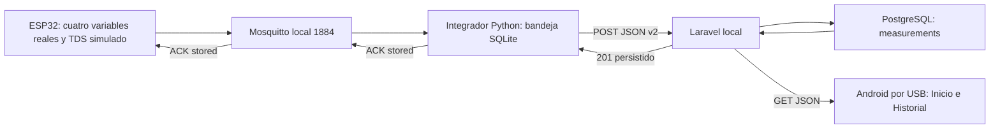

# Diagramas del Taller 5

Disponibles: [conexiones de señal documentadas](conexiones.md) y
[flujo local editable](flujo-local.mmd), probado con ESP32 y Android.
El esquema eléctrico completo de alimentación y el flujo en nube siguen pendientes.
Conservar fuente editable y exportación legible. Identificar TDS simulado y
componentes planeados; no presentar arquitectura objetivo como ya ejecutada.

